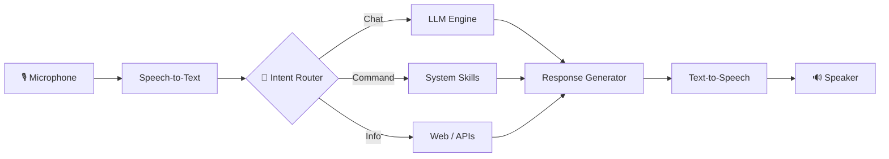

<!-- TODO: edit the [bracketed] parts and add assets/demo.gif -->

<div align="center">

<!-- Animated wave header -->


<!-- Typing animation -->
<a href="https://git.io/typing-svg">
  
</a>

<br/>

<!-- Badges -->


</div>

---

## 🧠 About

**Jarvis** is a personal AI assistant inspired by the one from Iron Man. It listens, understands, and acts: answering questions, controlling your system, automating everyday tasks, and talking back in natural speech.

> [One or two lines on why you built it, e.g. "Built to explore how far a fully local, customizable assistant can go."]

---

## 🎬 Demo

<div align="center">

<!-- Put your screen recording here: assets/demo.gif -->


*Say "Hey Jarvis" and watch it work.*

</div>

> 💡 **Tip:** Record with ScreenToGif or OBS, convert to GIF (under 10 MB), and save it as `assets/demo.gif`.

---

## ✨ Features

| | Feature | Description |
|---|---|---|
| 🎙️ | **Voice Commands** | Wake word + speech recognition for hands-free control |
| 🗣️ | **Natural Speech** | Text-to-speech replies with a customizable voice |
| 🤖 | **AI Conversation** | LLM-powered chat with context memory |
| 💻 | **System Control** | Open apps, search the web, manage files, adjust volume |
| 🌦️ | **Live Info** | Weather, news, time, and web lookups |
| 🧩 | **Modular Skills** | Add new abilities by dropping a file into `skills/` |
| 👤 | **Face Recognition** | Recognizes known people from the `knownface/` folder |
| 🖥️ | **GUI / HUD** | [Animated interface, if you have one] |

> Edit this table to match what your project really does.

---

## 🏗️ Architecture



---

## 🛠️ Tech Stack

<div align="center">


</div>

- **Language:** Python
- **Speech Recognition:** [e.g. SpeechRecognition / Whisper / Vosk]
- **Text-to-Speech:** [e.g. pyttsx3 / gTTS / Coqui]
- **AI / LLM:** [e.g. OpenAI / Gemini / Ollama (local)]
- **Other:** [e.g. OpenCV, PyAutoGUI, Tkinter / PyQt]

---

## 📁 Project Structure

```
JarvisAI/
├── knownface/           # Known faces used for face recognition
├── main.py              # Entry point (rename to match your file)
├── requirements.txt
├── .gitignore           # Ignores __pycache__/ and secrets
└── README.md
```

> 💡 Add `__pycache__/` to a `.gitignore` file so compiled Python files stop being uploaded.

---

## 🚀 Getting Started

### Prerequisites
- Python 3.10 or newer
- A working microphone and speakers
- [API key / local model, if needed]

### Installation

```bash
# 1. Clone the repository
git clone https://github.com/HemashreeVI/JarvisAI.git
cd JarvisAI

# 2. Create a virtual environment
python -m venv venv
source venv/bin/activate        # Windows: venv\Scripts\activate

# 3. Install dependencies
pip install -r requirements.txt

# 4. Add your keys
cp .env.example .env            # then edit .env

# 5. Run Jarvis
python main.py
```

---

## 🗣️ Example Commands

```text
"Hey Jarvis, what's the weather today?"
"Open YouTube"
"Search for the latest AI news"
"Tell me a joke"
"What time is it?"
"Shut down the system"
```

---

## 🗺️ Roadmap

- [x] Voice recognition and speech output
- [x] LLM conversation
- [x] Basic system automation
- [ ] Long-term memory
- [x] Face recognition of known faces
- [ ] Emotion and gesture detection
- [ ] Smart-home integration
- [ ] Mobile companion app

---

## 🤝 Contributing

Contributions are welcome!

1. Fork the repo
2. Create a branch: `git checkout -b feature/amazing-skill`
3. Commit your changes: `git commit -m "Add amazing skill"`
4. Push and open a Pull Request

---

## 📊 Repo Stats

<div align="center">


<br/>


</div>

---

## 📜 License

Distributed under the MIT License. See `LICENSE` for details.

---

<div align="center">

### 💙 Built by [Hemashree VI](https://github.com/HemashreeVI)

*If Jarvis helped or inspired you, drop a ⭐ on the repo!*


</div>
